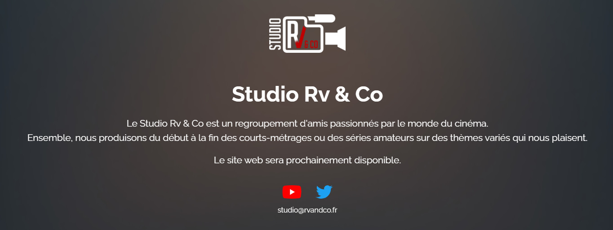

<div id="top"></div>
<br />

<div align="center">
<a href="https://github.com/StudioRvAndCo/Maintenance">
    
</a>

<h3 align="center">Maintenance</h3>


&nbsp;
&nbsp;


  <p align="center">
    Website maintenance page of the Rv & Co association.
    <br />
    <a href="https://rvandco.fr/"><strong>rvandco.fr »</strong></a>
  </p>
</div>
<br />

<details>
  <summary>Table of Contents</summary>
  <ol>
    <li>
      <a href="#about-the-project">About The Project</a>
      <ul>
        <li><a href="#features">Features</a></li>
        <li><a href="#tech-stack">Tech Stack</a></li>
      </ul>
    </li>
    <li>
      <a href="#getting-started">Getting Started</a>
      <ul>
        <li><a href="#prerequisites">Prerequisites</a></li>
        <li><a href="#run-locally">Run Locally</a></li>
        <li><a href="#deployment">Deployment</a></li>
      </ul>
    </li>
    <li><a href="#roadmap">Roadmap</a></li>
    <li><a href="#feedback">Feedback</a></li>
    <li><a href="#author">Author</a></li>
  </ol>
</details>

## About The Project

Maintenance page of the Rv & Co association website with links to the different social networks.

<div align="center"> 
  
</div>

### Features

- Logo and introduction
- Links to social networks
- Responsive Design

### Tech Stack

- [VueJS 3](https://vuejs.org/)
- [Sass](https://sass-lang.com/)
- [Vue-i18n](https://vue-i18n.intlify.dev/)

<p align="right">(<a href="#top">back to top</a>)</p>

## Getting Started

### Prerequisites

- Install [NodeJS](https://nodejs.org/) with [npm](https://www.npmjs.com/)

```bash
  curl -fsSL https://deb.nodesource.com/setup_16.x | sudo -E bash -
  sudo apt-get install -y nodejs
```

### Run locally

1. Clone the project

```bash
  git clone https://github.com/StudioRvAndCo/Maintenance
  cd Maintenance
```

2. Install dependencies

```bash
  npm install
```

3. Start the server

```bash
  npm run serve
```

The server should start on [localhost:8080](http://localhost:8080/).

### Deployment

To deploy this project run

```bash
  npm run build
```

A new `dist` folder will appear containing the entire compiled website.

<p align="right">(<a href="#top">back to top</a>)</p>

## Roadmap

- [x] Add logo, texts and links
- [x] Responsive design
- [ ] Reduce build size
- [ ] SVG background
- [ ] Add translations

<p align="right">(<a href="#top">back to top</a>)</p>

## Feedback

If you have any feedback, please reach out to us at [studio@rvandco.fr](mailto:studio@rvandco.fr).

<p align="right">(<a href="#top">back to top</a>)</p>

## Author

[@Minarox](https://www.github.com/Minarox)

<p align="right">(<a href="#top">back to top</a>)</p>
